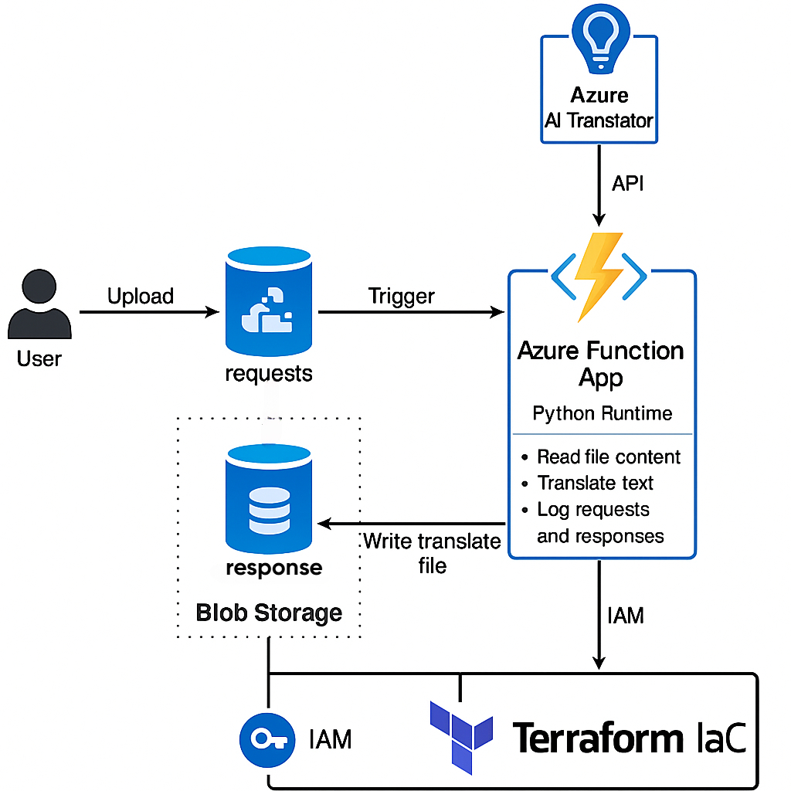

# azure-translator-automation

# Azure Translator Automation

## 📌 Project Objective

This project automates the process of translating text files using **Azure AI Translator**. It is built using **Terraform** for Infrastructure as Code (IaC), an **Azure Function App** to process translations, and **Azure Blob Storage** to manage input/output files. The solution ensures that users can upload a text file in one language and receive a translated version securely and efficiently in another.

---

## 🧩 Project Architecture

### 🧩 Components

- **Azure Blob Storage**
  - `requests` container: accepts user-uploaded files to be translated.
  - `responses` container: stores the translated output and log files.

- **Azure Function App**
  - Triggered automatically when a file is added to the `requests` container.
  - Written in Python using Azure SDK and Azure AI Translator API.
  - Reads the input file, sends text to the translator, and uploads the result to the `responses` container.

- **Azure AI Translator**
  - Cloud-based API used to translate the file contents.
  - Supports multiple languages and integrates with Azure securely.

- **Terraform**
  - Manages infrastructure provisioning as code.
  - Deploys storage accounts, containers, Function Apps, IAM roles, and permissions in a repeatable and version-controlled way.

- **IAM (Identity and Access Management)**
  - Uses **Managed Identity** for secure, keyless access.
  - Azure Function App gets **Blob Storage Contributor** role to interact with containers.

---

### 🔁 Workflow Explanation

1. **User Uploads File**
   - A `.txt` file is uploaded to the `requests` container using Azure tools or HTTP.

2. **Azure Function is Triggered**
   - Triggered via Blob trigger when a new file is added.
   - Python script:
     - Reads the uploaded file
     - Extracts text and language info
     - Sends content to Azure Translator API

3. **Translation Output is Saved**
   - Receives translated content
   - Creates a new file with translated text
   - Uploads both the translation and a log file to the `responses` container

4. **User Retrieves Translated File**
   - Users can download the translated file from the `responses` container.

---

